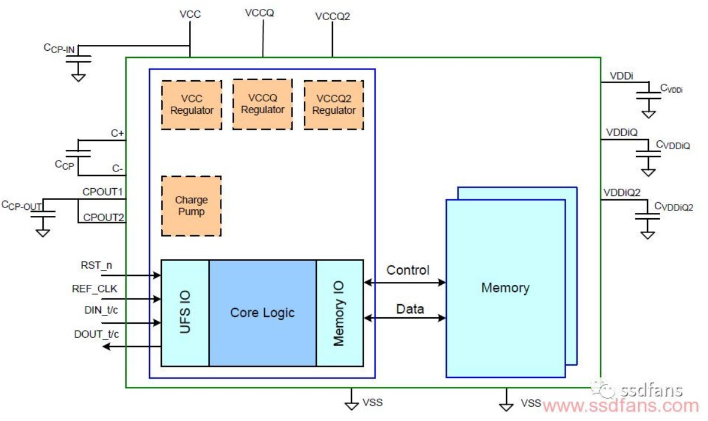
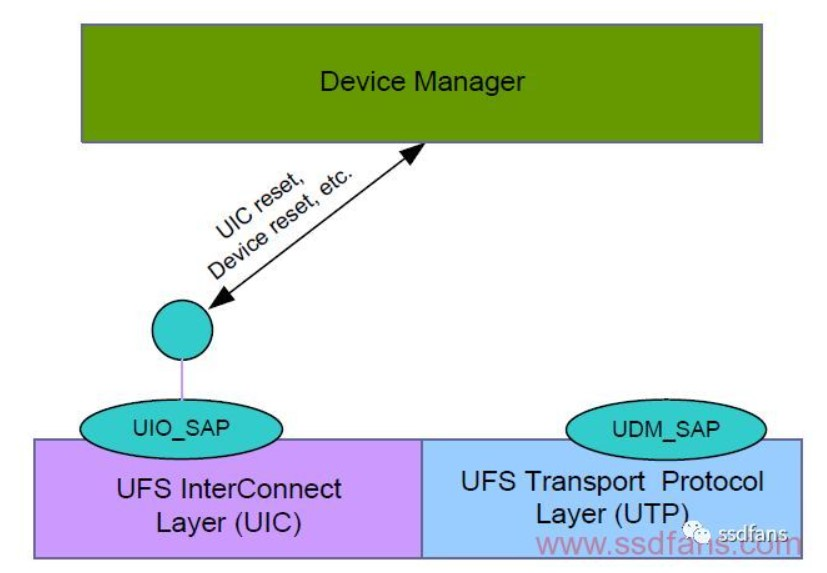
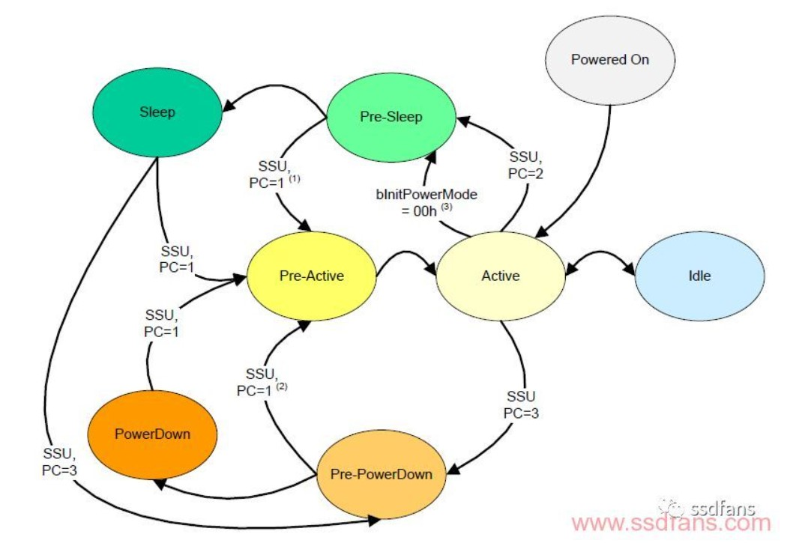
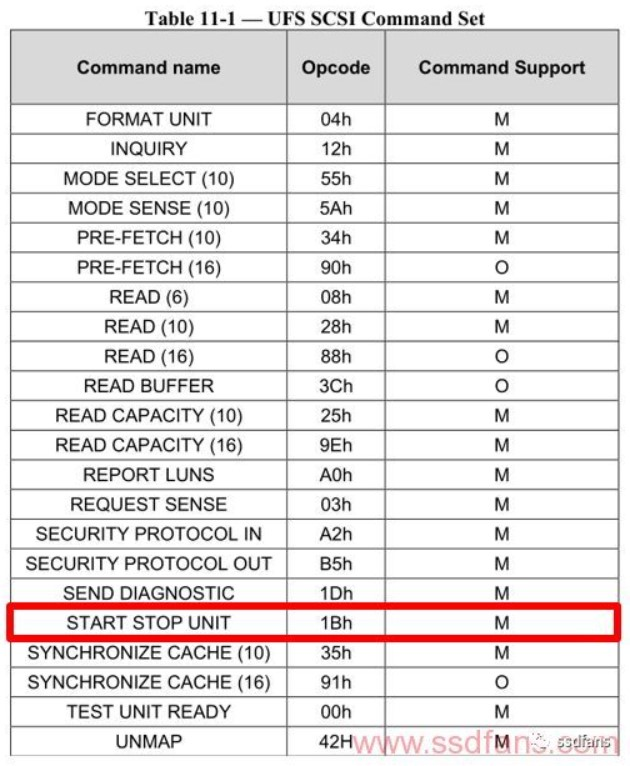

参考：

https://blog.csdn.net/don_chiang709/article/details/89314552

https://blog.csdn.net/G_Crisis/article/details/83508468?ops_request_misc=%257B%2522request%255Fid%2522%253A%2522160006997919195188317779%2522%252C%2522scm%2522%253A%252220140713.130102334.pc%255Fall.%2522%257D&request_id=160006997919195188317779&biz_id=0&utm_medium=distribute.pc_search_result.none-task-blog-2~all~first_rank_ecpm_v3~pc_rank_v2-2-83508468.first_rank_ecpm_v3_pc_rank_v2&utm_term=ufs+clk&spm=1018.2118.3001.4187（上下电）

### 1、ufs电源框架



### 2、概述

1、UFS device主要由三部分组成

```
1、UFS前端部分M-PHY
2、UFS控制器
3、闪存（上图的memory）
```

2、 三个供电电压，VCC,VCCQ和VCCQ2，分别给UFS设备模块供电 

```
1、VCC给闪存介质供电
2、VCCQ一般给闪存输入输出接口和UFS控制器供电
3、VCCQ2一般给M-PHY或其它一些低电压模块供电
```

3、UFS采用MIPI的M-PHY作为物理层和uni-pro作为数据链路层，M-PHY有高速模式（ High Speed Mode, HS-MODE） 和低速模式 （Low Speed Mode, LS-MODE） ，其中高速模式下， M-PHY有两种状态：STALL和HS-BURST，低速模式下，M-PHY有三种状态：LINE-CFG，SLEEP和PWM-BURST。

4、 当链路上没有数据传输时，M-PHY会自动切换到STALL或者SLEEP状态下，这两种状态为省电状态。 

5、 除此之外，M-PHY还有一种更加省电的状态，那就是HIBERN8 （Hibernate，休眠状态），这种状态下，M-PHY极为省电。UFS主机和UFS设备不可能一直交互数据，总有闲下来的时候。当UFS主机没有读写UFS设备，它会让彼此链路进入休眠状态，即HIBERN8。那UFS主机如何通知M-PHY切换到休眠状态呢？ 

### 3、M-PHY切换到休眠（HIBERN8）状态



ufs的四层通讯中应用层时可以直接通过Device manager绕过UTP和UIC（uni-pro和m-phy）通讯，除了上图的reset，还可以发送 DME_HIBERNATE_ENTER和DME_HIBERNATE_EXIT 让数据链路层进入或退出休眠

### 4、UFS电源状态

 UFS定义了4种基本功耗模式：Active，Idle，Power Down和Sleep（简称AIDS），外加3个过渡功耗模式：Pre-Active, Pre-Sleep和Pre-PowerDown，一共是7种功耗模式。非常4+3！ 

```
1、Active模式：UFS设备在执行命令或者做后台任务（Background Operation）时处于这种状态；
2、Idle模式：UFS设备空闲时，即既没有来自UFS主机的命令，自身也没有后台任务需要处理，设备就处于该状态；
3、Sleep模式：闲得瞌睡了。睡眠模式下，VCC电源可能被切断（取决UFS设备设计）。VCC一般给闪存供电，即切断闪存供电。
4、Power Down模式：掉电模式下，所有电源供电VCC, VCCQ和VCCQ2都可能被掐断（取决UFS设备设计），该模式是最省电的功耗模式了。
```



我们看到，触发模式之间转换的很多是SSU，那么什么是SSU? SSU是Start Stop Unit的缩写，它是UFS协议中的一个基本命令，主机用它来切换UFS设备的功耗模式。

### 5、UFS scsi命令集



### 6、UFS设备如何自己节能

 注意，UFS设备的这些功耗状态，和前面说的M-PHY接口的STALL，SLEEP或者HIBERN8状态是独立的，两者没有必然联系。比如，当前M-PHY处于HIBERN8状态，UFS设备可以处于以上状态中的任何一种，比如UFS设备可以是处于Active状态，没有要求说你休眠了我也得跟着休眠。 

 比如，UFS刚上电时，UFS进入Active状态，一段时间如果没有来自主机的命令，自己内部也没有后台任务要处理，UFS设备将进入Idle状态。Idle意味着无事可做，这时候主机也没有发任何SSU命令要求UFS设备进入指定的状态（老板也没有叫你去做什么），好的UFS设备，这个时候就要想想怎么去省电。举例来说，如果当前M-PHY处于HIBERN8状态，说明主机目前不会访问UFS设备，因此，UFS设备可以做一些节能设计：比如把当前UFS设备的软硬件上下文保存到闪存，然后切断所有电源以达到省电目的。待M-PHY接口退出HIBERN8状态，UFS设备上电，然后把软硬件上下文加载运行。 