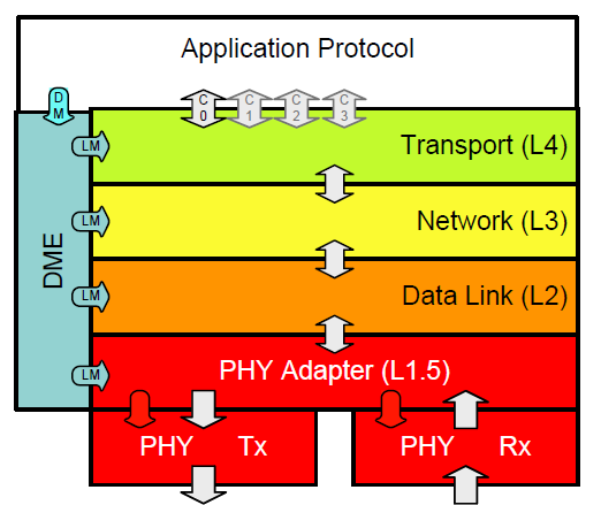

参考：

https://blog.csdn.net/feelabclihu/article/details/105502169


https://blog.csdn.net/shenjin_s/article/details/79761425?utm_medium=distribute.pc_relevant.none-task-blog-BlogCommendFromMachineLearnPai2-10.nonecase&depth_1-utm_source=distribute.pc_relevant.none-task-blog-BlogCommendFromMachineLearnPai2-10.nonecase


 [https://blog.csdn.net/u014645605/article/details/52063624?utm_medium=distribute.pc_aggpage_search_result.none-task-blog-2~all~first_rank_v2~rank_v25-7-52063624.nonecase&utm_term=ufs%E5%9C%B0%E5%9D%80%E5%88%86%E5%8C%BA](https://blog.csdn.net/u014645605/article/details/52063624?utm_medium=distribute.pc_aggpage_search_result.none-task-blog-2~all~first_rank_v2~rank_v25-7-52063624.nonecase&utm_term=ufs地址分区) 


 https://www.sohu.com/a/235249017_505795 


 https://blog.csdn.net/don_chiang709/article/details/89313836?utm_medium=distribute.pc_relevant_download.none-task-blog-blogcommendfrombaidu-3.nonecase&depth_1-utm_source=distribute.pc_relevant_download.none-task-blog-blogcommendfrombaidu-3.nonecas （UFS协议栈）


 https://so.csdn.net/so/search/s.do?q=ufs&t=blog&u=don_chiang709 （博主系列文章）


 https://www.pianshen.com/article/85621103730/ （ufshci driver）


### 1、概述

UFS是目前广泛应用于移动设备的闪存，传输速度默认1248MB/S，可以配置为4096MB/S

缩写词：

```
UIC：ufs interface controller

LUN：logical unity num

UTP：ufs transfer protocal

UPIP：UFS protocal information units

SAP：service access points

HBA：host bus adapter

DME：device management entity

CPort：CPort is a SAP on the UniPro transport layer (L4) within a device that is used for
connection-oriented data transmission

UTRD：ufs transfer request desc

UTMD：ufs task management desc

MMIO：memory map io，ufshci寄存器在Linux中虚拟地址映射

ucd：ufs command desc

POR：power on reset

TMR：task management request，用于utp层

RTT：READY TO TRANSFER UPIU

RMMI：Reference M-PHY Module Interface 
```


### 2、ufs通讯架构


ufs采用四层结构设计，从上到下依次为，只有传输层是JEDEC自己的

- a、 应用层，也是命令层，是T10的

```
包含了任务管理（task manager）、ufs command set layer（ucs）子层
1、任务管理
	处理command queue来控制任务，比如abort终止之前的command
2、ucs
	处理command（比如读写），主要将scsi command转换为原生的ufs command
3、设备管理（device manager）
	处理一些设备电源功耗相关的command，比如suspend、resume、power down、别的一些电源操作
	可以通过两个服务控制host controller：
		UDM-SAP：比如通过UTP获取设备描述符
		UIO-SAP：比如通过UIC（位于传输层和数据链路层之间作为抽象接口为上层提供服务）对host进行reset
```

- b、 传输层（UTP），符合JEDEC

```
1、传输层类似tcp/ip的传输层，host端的传输层对应device端的传输层，将应用层（device manager和application）的命令转换为UFS protocol information units (UPIU) 
2、传输层为上层提供了三个服务
	a、UDM_SAP – Communicates with the device manager
		处理dm的设备管理命令
	b、UTP_CMD_SAP – Transports commands
		处理ucs生成的ufs command（比如read/write）
	c、UTP_TM_SAP – Transports task management functions
		处理task management生成的command（比如设备abort等）
3、传输层使用CS模型
	主机端相当于client，device的LUN（logiccal unit）相当于server
	device的么一个LUN都有一个task queue，同一时间只能服务一个task，不同的LUN可以同时服务于一个task
4、一个典型的命令时序
	COMMAND UPIU
	DATA out upiu （可选）
	DATA in upiu（可选）
	Response UPIU
	最终的数据传输是通过DMA
```

- c、uic（ufs interconnter layer），符合MIPI，这两层统称为互连层

```
1、为传输层和应用层提供服务接口，包括两个服务
	UIC_SAP – Transports UPIU from the UFS host to the UFS device
			  服务于传输层
	UIO_SAP – Transports queries and control of device management	
			  服务于设备管理层

2、该层主要包含了UFS四层中的下面两层（MIPI移动行业处理器接口）
	c. 数据链路层（MIPI UniPro）
		unipro本身也是一个完成的协议栈，如下图
		传输层UFS只支持CPort0
		ufs无需网络层
		数据链路层（L2）支持流控、CRC生成和校验、重传机制等，UFS利用了UniPro的数据链路层为主机和设备之间通讯提供可靠的连接。
	d. 物理层（MIPI M-PHY）
		使用8/10编码、差分信号串行数据传输。数据传输分高低速模式，每种模式下又有几种不同的速度档。
```



### 3、物理连接

ufs属于一种通用闪存规范，通信的两端包括host controller（一般是soc内部集成）和device（闪存设备），两端通过时钟线、复位线、控制输出、传输输出、控制输入、传输输入

- host

  host的控制器通过MIPI规范的UIC物理接口和device端的UIC物理接口连接

  两端的UIC通过上面描述的6根物理线连接

- host与ufs设备连接


- ufs内部结构


### 4、LUN

- 1、ufs中lun的分布


​	LUN是位于闪存设备的独立单元，用来处理host传输过来的command

​	一个UFS设备最多能有8个LUN（2个boot lun、1个rpmb lun、剩下的user lun）

​	ufs默认会支持一些well-known的lun，但这些lun只支持部分scsi命令

```
https://www.sohu.com/a/235249017_505795中说ufs2.1最多支持32个普通lu和4个well-known lun

report lun：Inquiry, request sense, test unit ready, start stop
unit，代表设备向主机报告设备lu清单。report lun命令用来访问ufs lun
UFS device：Inquiry, request sense, test unit ready, start stop
unit，ufs的法人，当ufs接受到的command没有指定lu时由该lu处理command，比如格式化、切换功耗
boot lun：Inquiry, request sense, test unit ready, read (6),
read (10), red (16)，存储启动代码，但是它本身不存储启动代码，只是一个虚拟的lu，真正的启动代码在普通lu的
rpmb lun：Inquiry, request sense, test unit ready, read (6),
read (10), red (16),该lu中读写数据，会校验合法性

写boot lu、rpmb lu时没有cache，就是说，数据必须写到闪存中以后，这笔写命令才算完成
写普通lu时有cache，即主机数据到设备的内部buffer，设备就会回命令完成状态给主机。
```


- 2、lun的组成


lun是ufs内部独立的单元，一个lun一般由以下两部分组成

```
1、Device server
	概念上用来处理来自client的scsi命令
2、Task manager 
	控制scsi命令的执行顺序和任务管理
3、task
	任务接受自client端一系列的需要被处理的任务
```

- 3、lun的意义

```
ufs中的每个lu的地址是独立的，主机端访问ufs时必须在UPIU中指定lun，这样主机才知道访问哪个lu（逻辑单元）
```

- 4、lun的独立

```
1、逻辑地址空间是独立的
	每个lun的逻辑地址都是独立的，都是从LBA0开始
2、逻辑块大小可以不同
	可以为4KB
3、可以有不同的安全属性
	可以设置不同的写保护属性
4、每个lu可以有自己独立的命令队列
5、每个lu可以存储不同的数据
	比如有的lu存储boot代码
	有的lu存储普通用户数据
	有的lu存储用户特殊数据
```

- 5、ufs的启动boot lu

```
1、ufs有两个boot lu，如果启动代码在ufs中，那么怎么判断从哪个lu启动呢？
	主机启动时（pbl），首先应该向ufs发送query，获取bBootLunEn属性，该属性标识当前活跃的boot lu	
```


### 5、UFS控制器


- 1、概述

```
负责管理应用软件和ufs之间的接口，上图左边是ufshci，cpu通过AHB和axi总线访问ufshci控制器，ufs暴露给Linux得只是一个ip，都需要通过ufshci提供得接口去访问

ufs控制器在物理上连接MPHY，Linux无法直接操作MPHY（？？）
```

- 2、组成

```
1、host controller capabilities（vendor specific）
2、UTP transfer request
	UTP Transfer Request这一块的寄存器提供了指向UTRD （UTP Transfer Request Descriptor）List的指针地址
	UTRD有0~31个，即32个，意味着UFS拥有32个slot，SOC层可以同时接受32个请求
	32个UTRD是物理连续的，这点很重要，因为连续，可以直接根据slot序号直接获取到UTRD
	UTRD里面包含了UPIU的地址，UPIU的size是固定的，否则AXI怎么能准确的把response信息填充到对应请求的Response UPIU里面呢
3、UFS UTP controller (QTI specific) – Responsible for UTP layer functionality of the UFS controller
4、UniPro controller (third party) – Responsible for UIC layer functionality of the UFS controller
```

- 3、ufshci常用得寄存器


